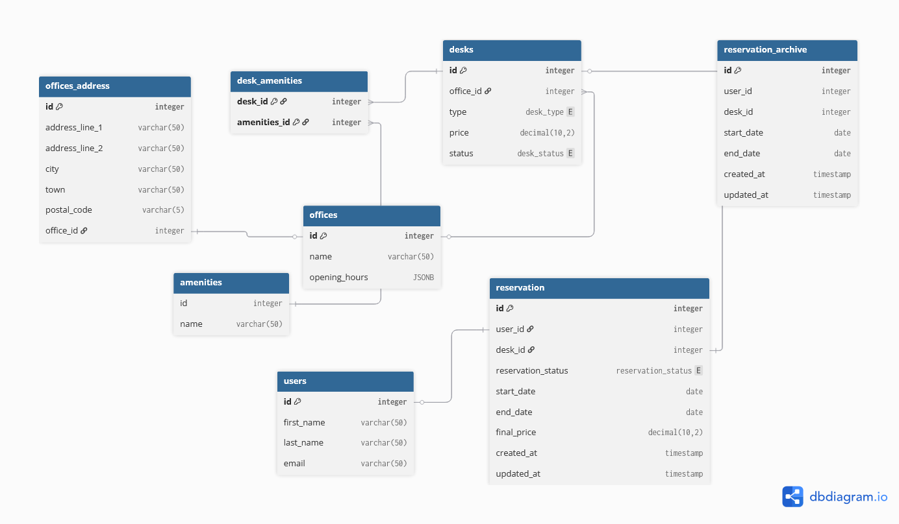

# Project Overview

SpaceFlow is a comprehensive backend system for managing coworking spaces, desk reservations, and office analytics. This project was developed as a hands-on consolidation of knowledge from the Microsoft Backend Development Course, focusing on building scalable, maintainable, and robust enterprise-grade APIs using .NET 9/10 and PostgreSQL.

## The project follows a clean, decoupled architecture to ensure "Separation of Concerns":

- Controllers: Handle HTTP requests and manage API routing.

- Services: Contain the core business logic (The "Heart" of the app).

- Interfaces: Define contracts, allowing for easy testing and Dependency Injection.

- DTOs: Using C# records for immutable data transfer between layers.

- Models: Entity Framework Core entities representing the database schema.

- Exceptions: Custom domain-specific exceptions for granular error handling.

- Middleware: Global exception handling and performance tracking.

## Database diagram


## Key Technical Features

Advanced Database Consistency (Transactions & Isolation)

To prevent "Race Conditions" (e.g., two users booking the same desk at the same millisecond), the ReservationService implements Optimistic Concurrency and Manual Transactions.

- Serializable Isolation Level: Used during reservation creation to ensure that the "check-then-insert" logic is truly atomic and safe from any side effects of concurrent requests.

SQL Optimization: Views & Procedures

Instead of overloading the application with heavy LINQ queries, the project offloads complex calculations to the database:

- PostgreSQL Views: v_OfficeOccupancy: Real-time calculation of office capacity using jsonb opening hours.

  ```SQL
  CREATE VIEW v_OfficeOccupancy AS
    SELECT 
        o."Id" AS OfficeId,
        o."Name" AS OfficeName,
        COUNT(d."Id") AS TotalDesks,
        (SELECT COUNT(*) 
         FROM "Reservations" r 
         JOIN "Desks" d2 ON r."Desk_id" = d2."Id"
         WHERE d2."OfficeId" = o."Id" 
           AND r."reservationStatus" != 2
           AND CURRENT_TIMESTAMP BETWEEN r."Start_date" AND r."End_date"
        ) AS CurrentlyOccupied,
        ROUND(
            (SELECT COUNT(*) FROM "Reservations" r JOIN "Desks" d2 ON r."Desk_id" = d2."Id" 
             WHERE d2."OfficeId" = o."Id" AND r."reservationStatus" != 2 
             AND CURRENT_TIMESTAMP BETWEEN r."Start_date" AND r."End_date")::decimal / 
            NULLIF(COUNT(d."Id"), 0)::decimal * 100, 2
        ) AS OccupancyRate
    FROM "Offices" o
    LEFT JOIN "Desks" d ON o."Id" = d."OfficeId"
    GROUP BY o."Id", o."Name";
  ```

- v_UserReservationHistory: A flattened view for fast retrieval of user data without complex multi-table joins in C#.

  ```SQL
    CREATE VIEW v_UserReservationHistory AS
      SELECT 
        r."Id" AS ReservationId,
        r."User_id",
        u."FullName",
        d."Number" AS DeskNumber,
        o."Name" AS OfficeName,
        r."Start_date",
        r."End_date",
        r."final_price",
        EXTRACT(EPOCH FROM (r."End_date" - r."Start_date")) / 3600 AS DurationHours
    FROM "Reservations" r
    JOIN "Users" u ON r."User_id" = u."Id"
    JOIN "Desks" d ON r."Desk_id" = d."Id"
    JOIN "Offices" o ON d."OfficeId" = o."Id";
  ```

- Stored Procedures: ArchiveOldReservations: A PL/pgSQL procedure that handles data lifecycle management by moving records older than 3 months to a history table via a single atomic call.

  ```SQL
  CREATE OR REPLACE PROCEDURE ArchiveOldReservations()
  LANGUAGE plpgsql
  AS $$
  BEGIN
    INSERT INTO "ReservationsHistory" (
        "Id", "User_id", "Desk_id", "Start_date", "End_date", "Created_at", "Updated_at", "TotalPrice"
    )
    SELECT 
        "Id", "User_id", "Desk_id", "Start_date", "End_date", "Created_at", "Updated_at", "final_price"
    FROM "Reservations"
    WHERE "End_date" < CURRENT_DATE - INTERVAL '3 months';

    -- 2. Usuwanie z głównej tabeli
    DELETE FROM "Reservations"
    WHERE "End_date" < CURRENT_DATE - INTERVAL '3 months';
  END;
  $$;
  ```

## Global Exception Handling

Integrated a custom Middleware that catches domain exceptions and maps them to appropriate HTTP Status Codes (e.g., 409 Conflict), ensuring the API always returns a consistent JSON error contract.

## Some API Endpoints
- Reservations
```http
POST /api/reservations	Create a new desk reservation (Transaction-backed)
GET	/api/reservation/available-terms?deskId=&date=	Fetch available time slots for a specific desk
```
- Analytics & Admin
```http
GET	/api/admin/{userId}/history	Retrieve full history from the v_UserHistory view
GET	/api/admin/occupancy	Get real-time office occupancy via SQL View
POST /api/admin/archive	Manually trigger the SQL Archive Procedure
```
- Offices & Desks
```http
GET	/api/offices	List all available locations
POST /api/offices	Add a new office with jsonb opening hours
```
## Tech Stack

- Framework: .NET 9+ / ASP.NET Core Web API

- Language: C# 12+ (Records, LINQ, Async/Await)

- Database: PostgreSQL (PL/pgSQL, jsonb)

- ORM: Entity Framework Core (Code First)

- Documentation: Swagger / OpenAPI

- Tools: pgAdmin, Postman

## Learning Outcomes

This project serves as a portfolio of skills acquired during the Microsoft Backend path, specifically:

- Serialization/Deserialization of complex jsonb types within SQL.

- Implementing Async/Await patterns across the entire stack.

- Managing Database Migrations and Fluent API configurations.

- Understanding SQL Isolation Levels and their impact on performance vs. safety.
